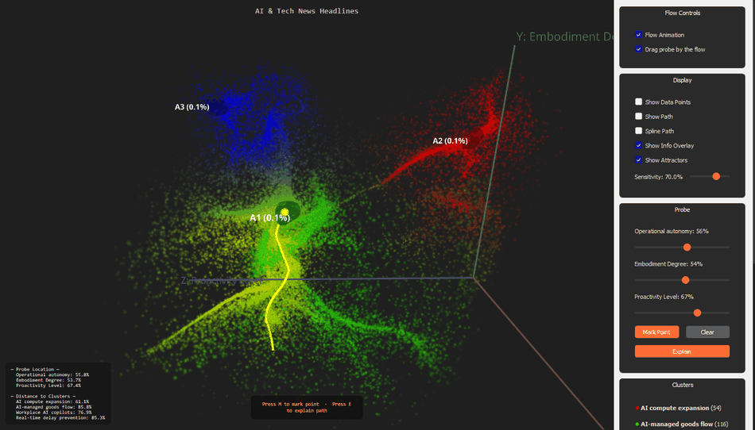
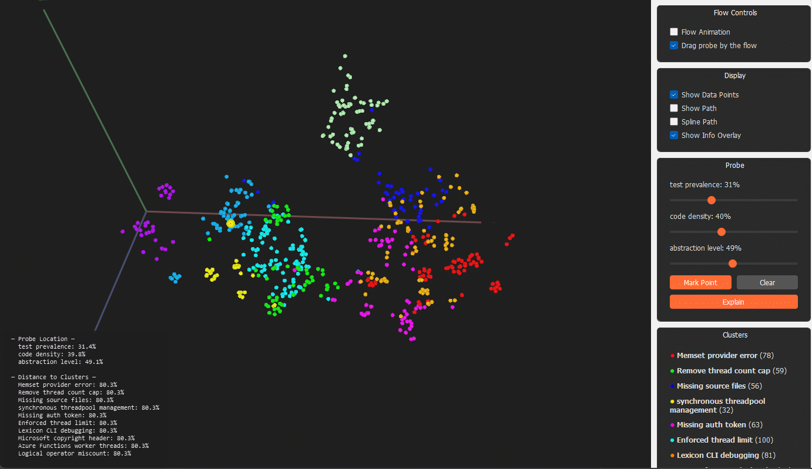

# TraceScope

<p align="center">
  
</p>

**TraceScope maps the flow of meaning**
Embed, cluster, and visualize any collection of texts in 3D semantic space — then learn a continuous semantic flow field over that space, so you can see not just where texts are, but how meaning tends to move between them.

TraceScope builds a rich semantic map from your data — with labeled axes, named clusters, trajectories, and a trained flow model that reveals how themes, intent, style, or reasoning evolve across time.

Works with **anything**: chatbot conversations, agent traces, news headlines, research papers, product reviews, diary entries, support logs, or any ordered collection of text.

Use it in two ways:
- **Interactive GUI** for visual exploration, interpretability, and presentation
- **Lightweight API** for integration into LLM agents, observability pipelines, research tools, and semantic monitoring systems

## Which flow model should you use?

TraceScope currently defaults to the more conservative `mdn` flow model, but for most users I recommend `rbf`: it is usually faster, does not require PyTorch, and often preserves richer local structure in the 3D semantic flow. Use `mdn` when you want a coarse, stable global overview or extra smoothing on noisy data; use `rbf` when you want finer attractor structure and higher-quality flow fields. Set it either in `TraceScopeConfig(flow_mode="rbf")`, in `pipeline.analyze(..., flow_mode="rbf")`, or by running an example with `--rbf`.

## Why TraceScope

Most embedding tools show a static cloud of points. TraceScope goes further:

- **Semantic structure** — discover clusters, labeled axes, and nearest neighbors
- **Semantic dynamics** — model trajectories and learn a continuous flow field over sparse text sequences
- **Interpretability** — inspect how a conversation, system, or dataset drifts, stabilizes, loops, or transitions
- **Integration** — use the same semantic space programmatically through a lightweight query API

## Concrete Examples

The **main showcase** is PRM800K below. 
These examples are **illustrative demonstrations** of how TraceScope works. They are meant to show the kinds of semantic structure and flow patterns the tool can reveal, **not** to serve as peer-reviewed empirical claims or definitive scientific conclusions
<details>
<summary><b><font color="#7aa2f7">Main example — PRM800K: The shape of mathematical reasoning</font></b></summary>

438 step-by-step math reasoning chains from [PRM800K](https://github.com/openai/prm800k) (MIT license) — each chain is labeled `solved` or `found_error` (binary, perfectly complementary). Overall 65% of paths have errors, only 35% solve correctly. This example uses the **RBF flow model instead of MDN** because it yielded better, clearer results on this dataset. TraceScope's RBF flow reveals *where* in the reasoning space success and failure live — and how reasoning drifts between them.

<p align="center">
  
</p>

**What TraceScope found:**

In this run, the RBF flow discovers **four attractor basins** — stable endpoints where reasoning converges. **every attractor basin has a lower error rate than the 65% dataset average**. Flow convergence itself is a signal of quality — when reasoning settles into a stable pattern, it outperforms the average.

The best-performing attractor (A3: 62% solved) is the most *formulaic* (72%) and strongly *concrete* (67%) — structured formula application grounded in specific numbers yielding decisive proofs. The worst-performing attractor (A4: 60% error) has dramatically lower *enumerative emphasis* (11% vs 42-67% for others) and sits deep in the abstract algebraic-sequence zone. The flow field suggests that skipping thorough case enumeration and jumping to abstract pattern-matching correlates with sharply higher errors.

Probe paths reveal that reasoning quality is not a one-way street. Paths don't simply "improve" or "degrade" — they oscillate, crossing between attractor zones with scores swinging sharply. One path starts perfect (solved=1.0), crashes to complete failure (found_error=1.0) within 15% of its journey as it drifts into A4, and never recovers. Another crosses all three zones (A1->A3->A2), with errors spiking during each basin transition before partially recovering. A2 emerges as the strongest recovery attractor: one path enters it at 100% error and recovers to 80% solved within 30% of the journey.

The most common pattern: **paths that stay within a single attractor basin maintain bounded oscillation, while basin-crossing paths experience score turbulence during the transition.** This suggests that shifting reasoning strategy mid-problem is risky — the intermediate zone between stable modes is where errors spike.

**Run it yourself:**

> [!WARNING]
> Even though this example locks seeds for local computation, upstream embedding / LLM providers are not guaranteed to be bitwise deterministic. You may therefore see small run-to-run differences in axes, cluster boundaries, attractor counts, or basin shapes. For serious experiments, rerun and test attractor-basin sensitivity before drawing strong conclusions.

```bash
python examples/prm_demo.py
```
</details>

<details>
<summary><b><font color="#d0d7de">Live interactive demo — Recent AI papers in the browser</font></b></summary>

Try TraceScope in the browser: **https://pixedar.github.io/ai/tracescope/**

Snapshot updated: **07.05.2026**. AI research moves quickly, so this demo can become outdated depending on when you check it.

This hosted demo shows an interactive 3D semantic flow map of recent AI papers, with particles, attractors, probe controls, and cached explanations. It is the fastest way to explore TraceScope without installing anything.

For each arXiv paper category, the demo builds a path showing how paper meanings and topics changed over the last six months. TraceScope then learns a generalized flow model from many such category paths.

**Limitations:** paper publication timing is noisy, so this demo should be read as an approximate view of broad AI-research trends, not as peer-reviewed evidence about the field. TraceScope is strongest on native time-series data, such as step-by-step reasoning or agent trajectories; for research use, tune the flow parameters and validate the result statistically.

</details>

<details>
<summary><b>Additional example — AI & Tech News Headlines: Where is the industry flowing?</b></summary>

~350 synthetic news headlines spanning AI, chips, climate, energy, biotech, space, and more — a synthetic test to demonstrate what TraceScope reveals. In a real deployment you'd use actual news feeds.

<p align="center">
  
</p>

**What TraceScope found:**
- **Axes:** *Embodiment Gradient* (abstract AI → physical robotics), *Operational Centralization* (distributed → centralized), *Autonomy Level* (human-directed → fully autonomous)
- **Clusters:** AI Compute Expansion, Warehouse Orchestration, AI Office Copilots, Real-time Production AI
- In typical runs, the flow reveals a **small number of global attractors** — often two or three — that pull toward centralized, real-time, operational AI.

The exact attractor count can vary slightly across runs and providers, but the big-picture pattern is stable: the semantic flow repeatedly converges toward AI systems that coordinate physical operations, unify visibility with execution, and stabilize real-world processes in real time. That underlying directional structure is much clearer in the flow than in the raw point cloud alone.

**Note:** This uses synthetic headlines for demonstration. In practice, feed in real news data for genuine industry insights.

**Run it yourself:**

> [!WARNING]
> Even though this example locks seeds for local computation, upstream embedding / LLM providers are not guaranteed to be bitwise deterministic. You may therefore see small run-to-run differences in axes, cluster boundaries, attractor counts, or basin shapes. For serious experiments, rerun and test attractor-basin sensitivity before drawing strong conclusions.

```bash
python examples/ai_news_headlines.py
```
</details>

<details>
<summary><b>Additional example — SWE-agent: Hidden attractors in software engineering traces</b></summary>

Running TraceScope on the [SWE-agent trajectories](https://huggingface.co/datasets/nebius/SWE-agent-trajectories) dataset (CC-BY-4.0) — real thought/action/observation cycles from an autonomous coding agent working on GitHub issues.

<p align="center">
  
</p>

The MDN flow field typically uncovers **multiple global attractors** — often around two, sometimes more — even though the cluster distribution alone gives little hint of their existence. Traditional tools would show you clusters — TraceScope shows you the *currents* that pull agent behavior, computed from actual trajectory paths rather than static point distributions.

The exact attractor count can vary a bit across runs and providers, but the big picture is stable: the traces contain latent dynamical modes of agent behavior that are not obvious from the datapoints alone.

**Run it yourself:**

> [!WARNING]
> Even though this example locks seeds for local computation, upstream embedding / LLM providers are not guaranteed to be bitwise deterministic. You may therefore see small run-to-run differences in axes, cluster boundaries, attractor counts, or basin shapes. For serious experiments, rerun and test attractor-basin sensitivity before drawing strong conclusions.

```bash
python examples/swe_agent.py
```
</details>


## Installation

```bash
# Full install — GPU renderer, MDN flow models, all LLM providers
pip install tracescope==0.2.0a5
```

> **Note:** TraceScope is currently in alpha. Pinning the exact version (`==0.2.0a5`) tells pip to install this pre-release without using the global `--pre` flag, which would otherwise pull beta/RC versions of other dependencies.

**Lighter variants** (use `--no-deps` to skip the full dependency tree):

```bash
# CPU-only — renderer + all features, no PyTorch (RBF flow still works)
# Note: all results shown in the "Concrete Examples" section were tested
# using the full GPU PyTorch version, not this CPU-only install.
pip install --no-deps tracescope==0.2.0a5 && pip install -r https://raw.githubusercontent.com/Pixedar/TraceScope/master/requirements-cpu.txt

# API-only — analysis pipeline, no GUI, no PyTorch
pip install --no-deps tracescope==0.2.0a5 && pip install -r https://raw.githubusercontent.com/Pixedar/TraceScope/master/requirements-api.txt
```

**Linux users** — install the Qt platform dependency (required for the 3D renderer, skip for API-only use):
```bash
sudo apt-get install libxcb-xinerama0   # Debian/Ubuntu
```

An OpenAI API key is **required** for embeddings and LLM explanations. TraceScope will not work without it. Set it in a `.env` file or pass it directly:

```env
OPENAI_API_KEY=sk-...
```

## Quick Start

### Analyze a chatbot conversation
Useful for real-world agent debugging: reveal hidden conversational attractors, looping failure modes, unstable transitions, and recovery trajectories in multi-turn chats
```python
from tracescope import TraceScopeConfig, AnalysisPipeline, auto_import

config = TraceScopeConfig(embedding_model="text-embedding-3-large")
session = auto_import("conversation.json")
pipeline = AnalysisPipeline(config)
result = pipeline.analyze(session, train_flow=True, cache_path="cache/conversation")

print(f"Axes: {result.axis_info.labels}")
print(f"Clusters: {result.cluster_labels}")
```

### Analyze any list of texts
Turn any ordered text collection into a semantic trajectory — works best with **30+ entries** for meaningful clusters and flow fields.
```python
from tracescope import TraceScopeConfig, AnalysisPipeline, from_list

config = TraceScopeConfig()


session = from_list([
    "Fed holds rates steady amid inflation concerns",
    "Tech earnings surge on AI demand",
    "Climate summit reaches carbon emissions deal",
    "Housing market cools as mortgage rates rise",
    "Quantum computing startup hits milestone",
    # ... add more entries, to get meangful flow is recommended  to have at least 30+ entries, run examples/ai_news_headlines.py for a demo with 350 synthetic news headlines
])

pipeline = AnalysisPipeline(config)
result = pipeline.analyze(session, train_flow=True, cache_path="cache/headlines")
```

> **Tip:** The MDN flow model learns best from **30+ entries** across your paths. With only 5–10 entries the flow field will be sparse. For the richest visualizations, use datasets with 50+ texts or multiple paths via `from_lists()`.

### Visualize

The included `sample_data/prm_demo_paths.json` contains 438 math reasoning chains from the PRM800K dataset — a good example of visualizing the semantic flow of step-by-step mathematical problem solving across diverse problem types.

```python
from tracescope import (
    TraceScopeConfig, AnalysisPipeline, auto_import, launch_renderer,
)

config = TraceScopeConfig(embedding_model="text-embedding-3-large")
session = auto_import("sample_data/prm_demo_paths.json")
pipeline = AnalysisPipeline(config)
result = pipeline.analyze(session, train_flow=True, cache_path="cache/prm_demo")

# Interactive 3D renderer with flow field animation
# Controls: Space=flow, B=ball, P=points, +/-=size
launch_renderer(result, explainer=pipeline.explainer)
```

## Input Formats

TraceScope accepts data in multiple formats:

### From code — single path (list of strings)

```python
from tracescope import from_list

# label is optional — useful for identifying the session in multi-session workflows
session = from_list(["text one", "text two", "text three"], label="My texts")
```

### From code — multiple independent paths

Analyze several independent sequences together with shared embeddings, clusters, and axes, but a unified MDN flow field that correctly learns from each path independently (no spurious boundary velocities):

```python
from tracescope import TraceScopeConfig, AnalysisPipeline, from_lists

config = TraceScopeConfig()
pipeline = AnalysisPipeline(config)

# labels is optional — names each path for display purposes
session = from_lists([
    ["Fed holds rates steady", "Tech earnings surge on AI", "Housing market cools"],
    ["Climate summit reaches deal", "Quantum computing milestone", "Mars rover update"],
    ["New vaccine approved", "Hospital staffing crisis", "Mental health funding"],
     # ... add more entries, to get meangful flow is recommended  to have at least 30+ entries, check examples dir with arleady prepared datasets 
], labels=["Finance", "Science", "Health"])

result = pipeline.analyze(session, train_flow=True, cache_path="cache/multi_path")
```

### From file — auto-detected format

```python
from tracescope import auto_import

session = auto_import("data.json")
```

Supported JSON formats:

**Plain string array** — simplest, works for any text collection:
```json
["First text", "Second text", "Third text"]
```

**Multi-path** — multiple independent sequences analyzed together:
```json
{
  "paths": [
    ["Path 1 text A", "Path 1 text B", "Path 1 text C"],
    ["Path 2 text A", "Path 2 text B"]
  ],
  "labels": ["First path", "Second path"]
}
```

<details>
<summary><strong>OpenAI chat format</strong></summary>

```json
{
  "model": "gpt-5",
  "messages": [
    {"role": "user", "content": "Hello"},
    {"role": "assistant", "content": "Hi there!"}
  ]
}
```
</details>

<details>
<summary><strong>Anthropic format</strong></summary>

```json
{
  "model": "claude-sonnet-4-20250514",
  "messages": [
    {"role": "user", "content": "Hello"},
    {"role": "assistant", "content": [{"type": "text", "text": "Hi!"}]}
  ]
}
```
</details>

**Plain text** (`.txt` files, split on blank lines):
```
First message

Second message

Third message
```

## Scores

Attach numeric metadata to your traces for score-based visualization. Two levels:

- **Entry scores** — per-step values (e.g., confidence at each reasoning step)
- **Path scores** — per-path aggregate values (e.g., overall success/failure)

### Adding scores via `from_lists`

```python
from tracescope import from_lists

session = from_lists(
    paths=[
        ["Step 1: search", "Step 2: found result", "Step 3: write report"],
        ["Step 1: search", "Step 2: API timeout", "Step 3: retry failed"],
    ],
    labels=["Success", "Failure"],
    entry_scores=[
        [{"confidence": 0.6}, {"confidence": 0.85}, {"confidence": 0.95}],
        [{"confidence": 0.5}, {"confidence": 0.2}, {"confidence": 0.1}],
    ],
    path_scores={
        0: {"success": 1.0},
        1: {"success": 0.0},
    },
)
```

### Adding scores via `from_list`

```python
from tracescope import from_list

session = from_list(
    ["text one", "text two", "text three"],
    entry_scores=[{"quality": 0.9}, {"quality": 0.5}, {"quality": 0.8}],
)
```

### Visualization

Score channels automatically appear in the GPU renderer sidebar:
- **Flow particle coloring** — checkbox per channel colors flow particles by interpolated score (red→yellow→green)
- **Data point coloring** — checkbox per channel colors data points by score

Score coloring is precomputed on a 3D grid for full-speed animation (no per-frame overhead).

### Programmatic access

```python
query = TraceQuery(result, pipeline.embedding_provider)

# List available score channels
lookup = query.get_lookup()
print(lookup["score_channels"])  # {"success": {"mean": 0.67, "min": 0.0, "max": 1.0}, ...}

# Score summary with per-cluster and per-path breakdown
summary = query.score_summary("success")
print(summary["cluster_breakdown"])  # [{cluster, count, mean, min, max}, ...] (mean/min/max are None when count=0)
print(summary["path_breakdown"])     # [{path_label, path_score, entry_scores_count, entry_mean}, ...] (entry_mean is None when no entry scores)
```

## Programmatic API — TraceQuery

After running the pipeline once, use `TraceQuery` for fast programmatic access to the semantic space. No re-computation needed — everything is served from the pre-computed lookup table and velocity grid.

```python
from tracescope import TraceQuery

query = TraceQuery(result, pipeline.embedding_provider, pipeline.explainer)
```

### `get_lookup()` — Space metadata

Returns a dict with all computed information about the semantic space:

```python
lookup = query.get_lookup()

lookup["axis_labels"]    # ["topic depth", "technical level", "abstraction"]
lookup["clusters"]       # [{id, label, centroid_3d, size, sample_texts}, ...]
lookup["n_points"]       # number of original data points
lookup["has_flow"]       # whether flow field is available
lookup["axis_ranges"]    # [{axis, min, max}, ...]
lookup["embedding_model"] # e.g. "text-embedding-3-large"
lookup["score_channels"] # {"success": {"mean": 0.67, ...}, ...} (if scores exist)
```

### `explain_path(texts)` — Path through semantic space

Pass a list of new texts. They get embedded and projected into the existing 3D space using the same reducer. Returns where each point lands, which clusters it's near, and an LLM-generated explanation of the overall path.

```python
result = query.explain_path([
    "What is a variable?",
    "How do classes work?",
    "Explain distributed systems",
])

result["path_3d"]       # [[x,y,z], [x,y,z], [x,y,z]]
result["points"]        # per-point: axis_percentages, cluster_distances, nearest_texts
result["explanation"]   # LLM-generated path explanation
```

### `query_flow_at(text)` — Flow field snapshot

Embeds a single text and queries the flow field at that position. Returns the velocity vector decomposed into:
- **Axis components**: how strongly you're being pulled along each semantic axis
- **Cluster pull**: toward/away from each cluster with alignment score
- **Nearby points**: closest original texts and whether the flow would carry you through them

```python
result = query.query_flow_at("How do I deploy to production?")

result["velocity"]             # [vx, vy, vz]
result["speed"]                # magnitude
result["axis_decomposition"]   # [{axis_label, component, magnitude, direction}, ...]
result["cluster_pull"]         # [{cluster_label, alignment, distance, interpretation}, ...]
result["nearby_points"]        # [{text, distance, velocity_alignment, would_pass_through}, ...]
```

### `query_direction_at(texts)` — Direction estimate without flow field

Like `query_flow_at` but estimates direction from the path itself (no MDN needed). Pass 2+ texts — direction is computed from consecutive differences.

```python
result = query.query_direction_at([
    "What is Python?",
    "How do I use async/await?",
    "Building production microservices",
])

result["estimated_direction"]   # [dx, dy, dz]
result["estimated_magnitude"]   # float
result["axis_decomposition"]    # same format as query_flow_at
result["cluster_pull"]          # same format as query_flow_at
```

### `path_similarity(path_a, path_b)` — Compare semantic paths

Compares two text sequences using high-dimensional embeddings (no 3D projection). Uses Frechet distance (order-aware), DTW-aligned cosine similarity, and direction alignment.

```python
result = query.path_similarity(
    ["How to read files", "How to write files", "How to delete files"],
    ["How to open DB", "How to query tables", "How to close connections"],
)

result["overall_score"]          # 0-1, higher = more similar
result["direction_similarity"]   # are the paths going in the same direction?
result["frechet_distance"]       # order-aware distance (lower = closer)
result["mean_cosine_similarity"] # average point-to-point similarity
result["start_similarity"]       # how similar are the starting points
result["end_similarity"]         # how similar are the ending points
```

### Topology & flow probing (analysis-layer)

Extra read-only methods that derive topology metrics from the velocity
field TraceScope already learned (no extra training):

```python
query.topology_summary()           # attractors, basin_sizes,
                                   # mean_settling_time, transition_turbulence,
                                   # jacobian_stability, unstable_regions
query.integrate_flow(text, method="rk45")   # ODE-style probe (scipy RK45)
query.local_stability_at(text)              # numerical Jacobian + spectral radius
query.stability_grid()                      # per-cell stability over the grid
```

These are descriptions of the learned flow field, not guarantees about
the underlying language model. See `examples/state_tracking_topology.py`.

## Visualization

### Interactive 3D Renderer (`launch_renderer`)

All-in-one interactive 3D viewer with particle flow animation, probe controls, and LLM explanations. Uses GPU acceleration by default, falls back to software rendering automatically when no GPU is available.

```python
from tracescope import launch_renderer

# Basic — no LLM explain
launch_renderer(result)

# With LLM explanations (pass the pipeline's explainer)
launch_renderer(result, explainer=pipeline.explainer)
```

**GUI panels** (left sidebar):
- **Flow Controls** — flow animation and ball/probe toggle
- **Display** — data points, path visibility, spline path toggle, info overlay
- **Probe** — X/Y/Z sliders, mark/clear control points, Explain button
- **Clusters** — color-coded legend with cluster descriptions
- **Flow Settings** — particle opacity, speed multiplier, particle count slider, entropy coloring

**Double-click** on a data point in the 3D view to see its text, cluster, and metadata.

## Configuration

```python
from tracescope import TraceScopeConfig

config = TraceScopeConfig(
    openai_api_key="sk-...",          # or set OPENAI_API_KEY env var
    anthropic_api_key="sk-ant-...",   # optional, for Anthropic LLM provider
    embedding_model="text-embedding-3-large",  # or "text-embedding-3-small"
    embedding_provider_type="openai",
    llm_model="gpt-5-mini",          # for axis/cluster labeling
    llm_model_complex="gpt-5",       # for explanations (explain button, path explain)
    llm_provider_type="openai",      # or "anthropic"
    storage_dir="~/.tracescope",     # where embeddings and caches are stored
    cache_enabled=True,              # cache LLM responses and ML results

    # Flow model settings
    flow_mode="mdn",                 # "mdn" (default) or "rbf"
    mdn_hidden=100,                  # MDN hidden layer size (50-300)
    mdn_iters=8000,                  # MDN training iterations (2000-20000)
    velocity_grid_size=40,           # 3D velocity grid resolution (20-60)
    param_range=[5, 10, ..., 195],   # By default, UMAP searches the full range from 5 to 195 in steps of 5 which is slow; for much faster runs, you can provide only one or two values to search, but this will usually reduce quality
    rbf_kernel="thin_plate_spline",  # RBF kernel (see below)
    rbf_smoothing=0.1,               # RBF regularization (0 = exact)
    deterministic=True,              # seed all RNGs for reproducible results
)
```

> **Model override:** For the highest quality labels and explanations, set both models to `gpt-5`:
> ```python
> config = TraceScopeConfig(llm_model="gpt-5", llm_model_complex="gpt-5")
> ```
> You can use any OpenAI chat model — just pass its name to `llm_model` / `llm_model_complex`.

### Determinism

By default, all random number generators (UMAP, KMeans, MDN, attractor detection) are seeded for the most reproducible **local** results possible across runs on the same platform.

> **Important:** `deterministic=True` only controls randomness inside TraceScope itself. Results can still differ slightly across runs because upstream embedding / LLM providers are not guaranteed to be bitwise deterministic, and provider-side models can also change over time. In practice, that can shift projections, cluster boundaries, labels, attractor counts, or basin shapes even when local seeds are fixed.

To disable deterministic seeding (e.g., to explore different flow topologies):
```python
config = TraceScopeConfig(deterministic=False)
```

All example scripts also support `--rbf` to use the RBF flow model instead of MDN:
```bash
python examples/prm_demo.py --rbf
```

### Flow Models

TraceScope supports two flow field models for learning velocity fields from your semantic trajectories:

**MDN (Mixture Density Network)** — Default. A conservative 2-component neural network that learns a probabilistic velocity field. Best when you want a coarse, stable global overview or when extra smoothing helps on noisy data. Requires PyTorch.

```python
result = pipeline.analyze(session,
    flow_mode="mdn",
    mdn_hidden=150,     # larger = more expressive (default 100)
    mdn_iters=12000,    # more iterations = more refined (default 8000)
    velocity_grid_size=50,  # higher res grid (default 40)
)
```

**RBF (Radial Basis Function)** — Recommended for most users. Lightweight alternative using scipy's `RBFInterpolator`. Usually faster to compute, requires no PyTorch, and often preserves richer local structure with more distinct attractor basins in the 3D projected space.

```python
result = pipeline.analyze(session,
    flow_mode="rbf",
    rbf_kernel="thin_plate_spline",  # or "cubic", "linear", "quintic"
    rbf_smoothing=0.1,               # 0 = exact interpolation, higher = smoother
)
```

Both models produce compatible velocity grids and work identically in the visualizer and `TraceQuery` API.

### Result Caching

Save and reload full pipeline results to skip re-computation:

```python
# First run — computes everything and saves
result = pipeline.analyze(session, cache_path="results/my_analysis")

# Second run — loads instantly if texts and embedding model match
result = pipeline.analyze(session, cache_path="results/my_analysis")

# Manual save/load (parent directories are created automatically)
result.save_result("results/my_analysis")
loaded = AnalysisResult.load_result("results/my_analysis")
```

The cache uses a SHA-256 fingerprint of sorted texts + embedding model name. If your data changes, the cache is automatically invalidated and the pipeline re-runs.

## Pipeline Steps

The `analyze()` method runs these steps:

1. **Embed** — Convert texts to high-dimensional vectors (OpenAI text-embedding-3-large, 3072D)
2. **Cluster** — Auto-select k via silhouette scoring, KMeans with k-means++ (configurable `min_k`, default 3)
3. **Reduce to 3D** — UMAP/tSNE grid search with cosine metric, pick best silhouette
4. **Compute axes** — PCA on projected coordinates
5. **Label axes** — LLM generates 2-word semantic labels using TF-IDF keyword evolution
6. **Label clusters** — LLM generates cluster descriptions with avoid mechanism + keyword differentiation
7. **Train flow model** — MDN (mixture density network) or RBF (radial basis function) learns velocity field from the trajectory
8. **Build velocity grid** — configurable grid (default 40³) of pre-computed velocities for fast trilinear interpolation

## Relation to recurrent and continuous-thought model research

Recent work argues that feedforward transformers can struggle with dynamic state tracking because evolving state representations may be pushed deeper through the layer stack, making them hard to reuse at later steps. TraceScope does not modify transformer internals; instead, it provides an external semantic-state lens for observing similar phenomena in model outputs, conversations, and agent traces.

## Final notes
> Warning: TraceScope is experimental research software.
> The older 0.1.x releases were published before proper prerelease tagging
> and should not be interpreted as stable. For current builds, pin an
> explicit alpha version such as `tracescope==0.2.0a5`.

````
